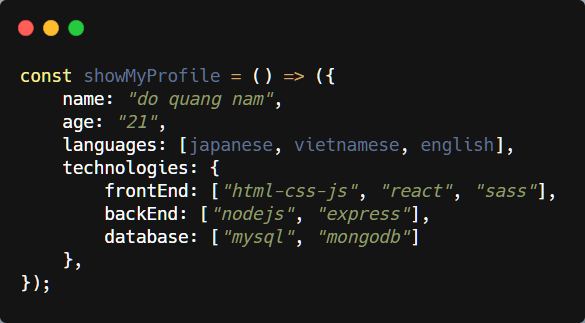

# Hi, I'm Nam ✌✌✌✌

<h2 align="center"> 😋😋😋 My Profile 😜😜😜</h2>
<h3 align="center">  I'm the FullStack Developer | Software Engineer </h3>
 

<!--  -->

### 🚀🚀🚀 About Me

- 🎓 Majoring in Software Engineering and Japanese
- 👀 I'm currently focusing on **fullstack web programing**
- 🔭 I'm currently learning **MERN Stack (MongoDB, Express, Reactjs, Nodejs)**
- **I** ❤️ **to think, learn, code, and customize everything**
- I also be interested in **music (guitar, flute and organ)** and everything about **Japan**

### 🐱‍🏍🐱‍🏍🐱‍🏍 Languages and Tools

<code></code>
<code></code>
<code></code>
<code></code>
<code></code>
<code></code>
<code></code>
<code></code>
<code></code>
<code></code>

### 👌👌👌 Others

I also have some post about **tech and web programing** on [_Viblo_](https://viblo.asia). Check all my posts [_here_](https://viblo.asia/u/NamDo "See all my posts!") !

- [[Javascript] super() method in javascript](https://viblo.asia/p/tim-hieu-cach-su-dung-super-trong-javascript-qua-vi-du-YWOZrxAr5Q0)
- [[Javascript] bind(), call(), apply() method in javascript](https://viblo.asia/p/tim-hieu-cach-su-dung-super-trong-javascript-qua-vi-du-YWOZrxAr5Q0)
- [[Css, Sass] Sass?? How to install and compile Sass?](https://viblo.asia/p/sass-la-gi-cai-dat-va-bien-dich-sass-sang-css-install-and-compile-sass-YWOZrx2E5Q0)
- [[Css, Sass] Sass Architecture \_ 7-1 Architecture](https://viblo.asia/p/cau-truc-files-trong-cac-du-an-su-dung-sass-voi-7-1-pattern-architecture-aWj53LOQK6m)

